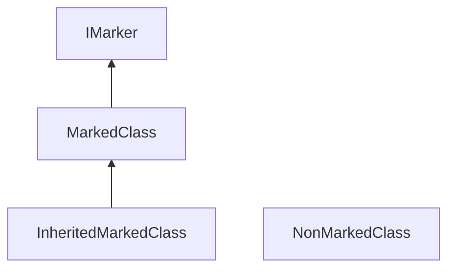

# Marker Interface

An empty interface that is used for marking certain classes for special processing. However in C#, attribute is preferred to do any sort of marking.

## Demo

In the `Program.cs`, it can get classes that inherits from `IMarker` interface through reflection.

## References

* [Marker Interface Isn't a Pattern or a Good Idea](https://dzone.com/articles/marker-interface-isnt-a-pattern-or-a-good-idea)
* [What is the Marker Design Pattern?](https://justgokus.medium.com/what-is-the-marker-design-pattern-26c38854ef6a)
* [Marker interface pattern](https://en.wikipedia.org/wiki/Marker_interface_pattern)

