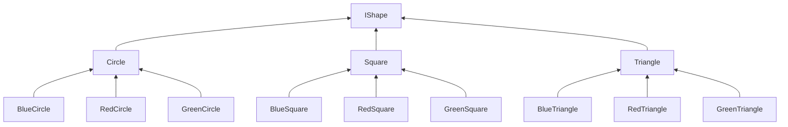
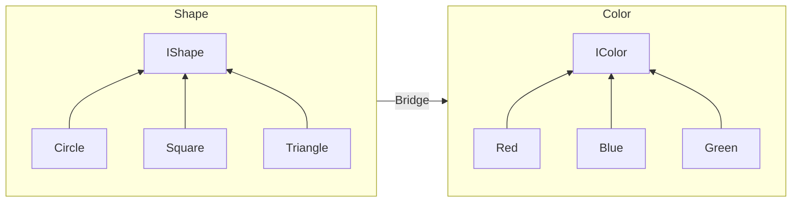

# Bridge Pattern

Seperating Abstraction with its Implementation. What does it means?

It means abstraction can have their own hierarchy, while implementation have their own hierarchy as well.
And abstraction uses the implementation through composition (dependency injection)

I have to admit that the word 'abstraction' and 'implementation' here are confusing. A more suitable way to describe it is separating two aspects of the business logic to their own hierarchy through composition. This reduces coupling and increase cohesion.

## Scenario



| | Circle | Square | Triangle |
|--- | --- | --- | --- |
| Red | Red Circle | Red Square | Red Triangle |
| Blue | Blue Circle | Blue Square | Blue Triangle |
| Green | Green Circle | Green Square | Green Triangle |

If we introduce another shape like Quadrilateral or a new color Yellow, we will need to implement 4 new subclasses; The number of classes grows exponentially, that is hard to manage and boilerplate codes with repeated logics.

### Application



Instead of creating subclass for every single variation, use composition instead.

## With Enum

Bridge pattern can be observed while using `enum` as well. For example, prefer this

```cs
enum Shape {
  Circle,
  Square,
  Triangle,
}

enum Color {
  Green,
  Red,
  Blue,
}
```

rather than

```cs
enum ColorShape {
  GreenCircle,
  BlueCircle,
  RedCircle,
  GreenSquare,
  BlueSquare,
  RedSquare,
  GreenTriangle,
  BlueTriangle,
  RedTriangle,
}
```

## Reference

- https://refactoring.guru/design-patterns/bridge
- https://app.pluralsight.com/library/courses/design-patterns-c-sharp-bridge/table-of-contents
